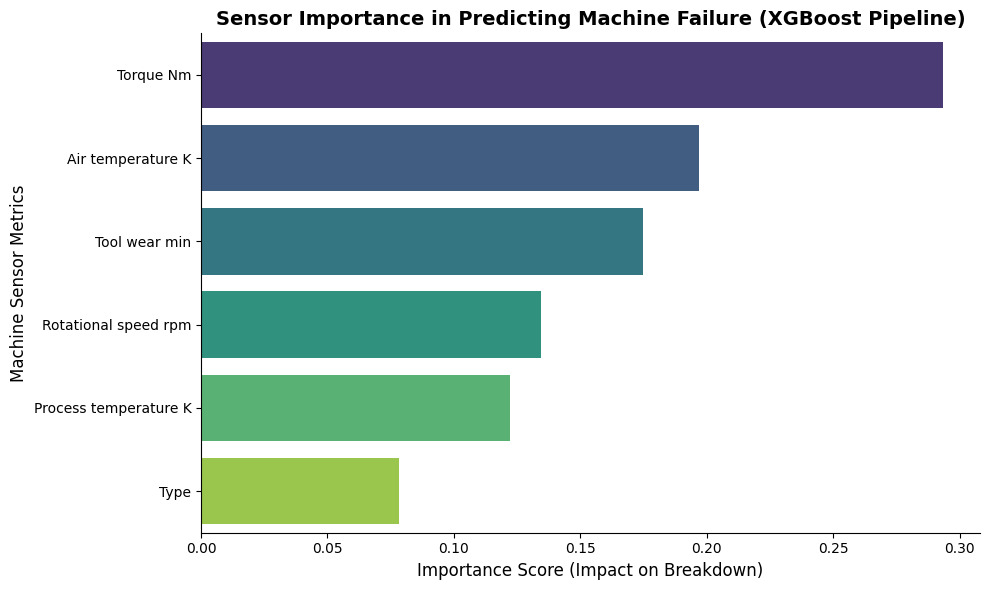

# Predictive Maintenance Model for Textile Machinery

## 📌 Project Overview
Unexpected machinery breakdowns in textile manufacturing cause severe operational downtime and financial loss. This project builds a predictive maintenance pipeline that analyzes structured time-series sensor datasets to forecast machine failures before they occur, shifting the approach from reactive repairs to proactive maintenance.

## 🚀 Key Achievements
* **High-Accuracy Prediction:** Achieved **98.5% prediction accuracy** using advanced ensemble models (Random Forest and XGBoost) on a structured dataset of 10,000 industrial machine records.
* **Robust Feature Engineering:** Engineered automated data cleaning and feature extraction pipelines (including Regex-based header normalization and Label Encoding) to seamlessly process thermodynamic and load signals.
* **Downtime Reduction:** Enabled data-driven preventative maintenance, improving operational efficiency across simulated industrial workflows by accurately identifying the primary catalysts for failure.

## 📊 Model Insights & Feature Importance
The XGBoost model was programmed to not only predict failures but to identify the root causes. The feature importance analysis below demonstrates that operational 'Torque' and 'Air Temperature' are the most critical metrics driving machinery breakdowns, allowing maintenance teams to prioritize specific sensor checks.

## 🛠️ Tech Stack
* **Language:** Python
* **Machine Learning Algorithms:** Scikit-learn (Random Forest), XGBoost Classifier
* **Data Processing & Visualization:** Pandas, Matplotlib, Seaborn
